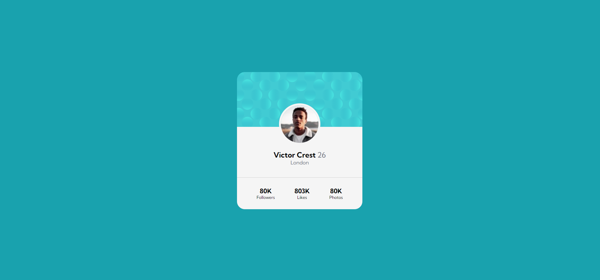
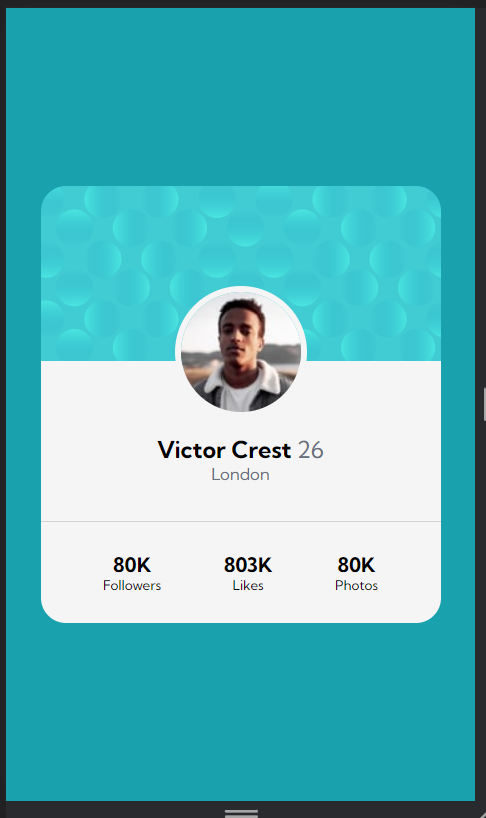

# Exercício Prática de CSS Avançado

Aqui foi criado um mini portifólio usando recursos HTML e CSS do meu curso de Desenvolvimento Web Fullstack dos módulos 
avançados visto até agora até agora utilizando Flexbox.

```
Profile Card
```
Veja abaixo como ficou o projeto do exercício.

## Versão desktop


## Versão Mobile


Foi bom para práticar e aprender algumas novas dicas e recursos em projetos.
